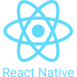

## Hi 👋 I’m Lakshyaraj Dash  
**A passionate programmer & Full Stack Developer from India 🇮🇳**

---

## 📊 GitHub Stats

-----

## 👨‍💻 About Me

- 🔭 Currently working on **[StudyRoom](https://github.com/lakshyaraj2006/studyroom)**
- 🌱 Learning **Angular** and **Data Science**
- 👨‍💻 Portfolio: **[lakshyarajdash.vercel.app](https://lakshyarajdash.vercel.app/)**
- 💬 Ask me about **JavaScript** and **Python**
- 📫 Reach me at **dashlakshyaraj2006@gmail.com**
- 📄 Resume: **[View PDF](https://lakshyarajdash.vercel.app/docs/resume.pdf)**

-----

### 🤝 Connect With Me

  
  
  
  
  
  

-----

## 🛠️ Skills

**Learning & Interests**
|||
|-----|-----|----|

**Languages**
||||||
|-----|-----|-----|-----|-----|-----|

**Frontend**
||||
|-----|-----|-----|-----|

**Backend**
||
|-----|-----|

**Full Stack**
|
|-----|

**Frameworks**
||||
|-----|-----|-----|-----|

**CSS Libraries**
||
|-----|-----|

**Databases**
||
|-----|-----|

**CMS**
|
|-----|

**Version Control**
|
|-----|

-----

## Tools, IDEs & Operating Systems

**Tools**
|
|-----|

**IDEs**
||||
|-----|-----|-----|-----|-----|

**Operating Systems**
||
|-----|-----|
